# CcGAN (Continous Conditional GAN)
    Author: Henrik Brøgger

### How to run

Firstly, ensure the "image2biomass" dataset exists in `src/data`.

The code can be run by opening a terminal in the root of the `inf367a_image2biomass` folder and running `sh src/main/ccgan_improved/run_train.sh`.

### What is it?

CcGAN (Continious Conditional General Adverserial Network) is a GAN model tweaked to work specifically on continous (regression tasks). For instance when creating new images based on a continous variable such as "age", or "angle". The [paper](https://arxiv.org/abs/2011.07466) implementing CcGAN makes many new novel changes, taking advantage of the continous nature of the data, instead of being limited by it.

### Why does it fits this task?

In the [csiro-biomass](https://www.kaggle.com/competitions/csiro-biomass) comptetion, datasets are continous, and there are a limited amount of images for such a image regression problem, meaning image augmentation or synthesis could be a valid method to increase model performance.

## How does it work?

The paper focuses on overcoming the challenges faced when converting a cGAN into a CcGAN, and how to evaluate a CcGAN.

### Issue 1: Loss functions

A typical **discriminator loss function** is simply "For all labels, label real images as real", and "for all labels, label fake images as fake". The issue here is that in a continous label space, there are theoretically infinite labels, and we may be missing true images for certain labels.

The solution to this problem is allowing the discriminator to be vicinal. If we wish to train the generator to discern if an image with "40 grass" is true or false, but we are missing true images with label 40 from our dataset, we can instead give the discriminator an image with "38 grass" on it, but lie and tell the discriminator there is actually 40 grass there. This works because images with *close* labels will look alike.
Suddenly, instead of having 0 images of "40 grass", we can have as many as we like (depending on how vicinal we are). However, there is a limit to how vicinal one can be, because an image with "0 grass", is not going to be representative of an image with "40 grass".

The paper presents two ways of doing this. Firstly, using a "hard" vicinity (HVE), where images above and below target variable **x** within some range **y** are chosen as examples of images with label **x**, and are all equally important (see image a below).
Secondly, using a "soft" vicinity (SVE), where all images in the dataset are chosen as examples of label **x**, but are weighted based on their distance from **x** (see image b below).
A HVE may be more strict about what images are used to train the discriminator, but a SVE may be able to leverage more training data to generate better images, faster.

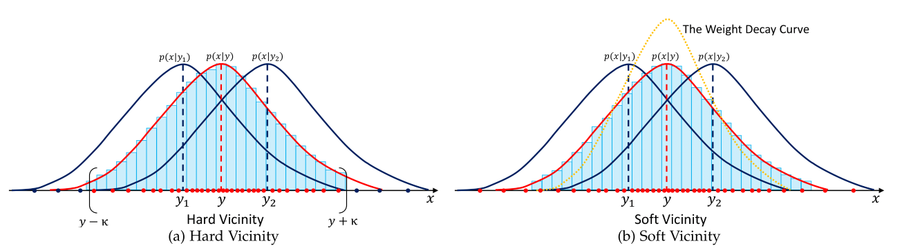

A typical **generator loss function** is simply "do not get caught by the discriminator". We give it a label, for instance "40", and ask it to generate an image with 40 grass.

$$Discriminator(Generator(y^g), y^g)$$

However, we want our generator to learn that images with "40 grass" and "39 grass" are visually similar. For each label *y* we wish to generate, we perturb it with gaussian noise.

$$Discriminator(Generator(y^g + \epsilon^g), y^g + \epsilon^g)$$

The idea is that the generator will learn that a **range** of labels match to a **range** of features. Instead of being very focused on generating a perfect "40 grass" or "39 grass" image, the generator can leverage the fact that these two images will likely be very similar. The generator model is learning how to generate a "40 grass", as well as a "39 grass" image, simultaneously.

### Issue 2: Label encodings

Typical cGAN's simply proide the binary label to their discriminator/generator, but this generalizes poorly to unknown labels, or labels with few examples. The paper suggests generating a meaningful embedding from the input label **y**. Before training the GAN's, two models are trained.
The first model is a regression model, which given an image, tries to predict the label on the image.

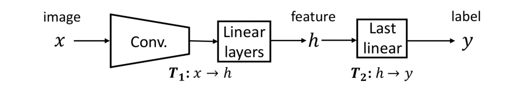

The second model we train flips the last linear layer of this model, instead turning labels **y** to features **h**.

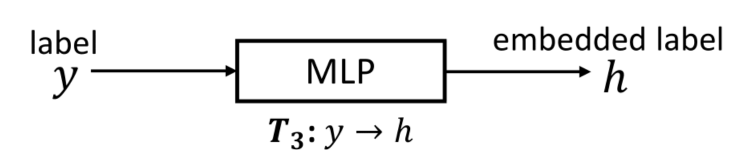

The idea is that instead of training on labels **y**, we instead run the labels through this second network, and generate some embedded representation of the label.
Given some unknown **y** that we did not have in our training data, this model may be able to turn the label into an embedding that could be understood by the models. It is important to note that for this to work we are leaning heavily on the first model, and assuming that it is able to, not only solve the problem, but also generate meaningful embeddings, that can be used for the next task.


### Issue 3: Evaluation

FiD score is a popular metric used for GAN's, but to evaluate CcGAN's, sliding-FID is a better representation. Much like with our discriminiator loss function, FiD assumes we have real images for all regression labels, something we do not have. Sliding-FiD solves this by computing the FiD score for an interval +-**x** within target FiD variable **y**, and taking the average FiD within the interval.

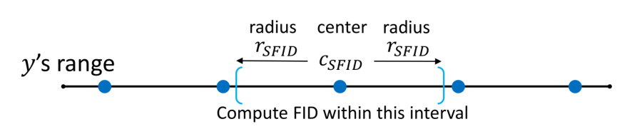

This should work in theory, since the FiD score for "40 grass" should be similar to that of "39 grass". There is a catch here, and that is that sliding FiD may hide underperforming labels, due to sorruding labels performing well.

### Model summary

In summary, the paper manages to create CcGAN's from cGAN's by leveraging the fact that the data used is continious, and that images with similar targets, will usually look similar. By allowing the generator and discriminator to be vicinal, models learn the continious nature of the data. By using sliding-FiD, models can be evaluated, even at targets with missing true images.

### Implementation

Simply, cloning [the repo](https://github.com/UBCDingXin/improved_CcGAN) and running the code with our dataset proved challening. The code was hardcoded to work with specific datasets, so changing variable and file names was required.

**Dataset conversion**: I needed to convert the image2biomass dataset to a `.h5` dataset. Labels needed to match some exact variable names, so going through the code and changing these to appropriate variabels was required. Changing the model could be an interesting endevour, but that is outside the scope of this paper.

**Image differences**: One big issue was the differing image size between the csiro-biomass dataset, and the datasets used by the CcGAN. Upto 192x192 (36864 pixels) images was the maximum used for this task, and so trying to implement creating new 1000x2000 (
2000000 pixels) images would be very difficult.
After talking to the course administrator, we reached an agreement where we would instead resize the 1000x2000 images to 64x64 (4096) and try to run the CcGAN model on these images. This image compression does mean that we now only have 0.2048% of the pixels in the original image. The idea of upsampling the images back to 1000x2000 to use them as training data is pointless, so it was just decided that we evaluate the 64x64 images as they are.

**Target variable**: The original CcGAN paper only provides code for making new images based on *a single label*, (age, angle.. etc). The csiro-biomass problem is asking us to do regression on *5* labels. This mismatch meant that creating images based on 5 labels would be difficult. In theory it is possible to modify both the **Improved label input** and **Vicinial Risk Minimization** logic to use euclidian distance in a vector space to measure similarity between images, instead of the scalar comparison that is now used. However this is out of scope of this paper, but would be interesting to try out, for another task.
**Due to this issue, we chose "Dry_Total_G" as the main target variable for the CcGAN task**

**Rounding target variable**: The code only takes in target variables as integers, but the image2biomass dataset includes floats. It was required to then round these floats down to the closest int. Here some data is lost, but this was required.

**Training time**: Even with this massive image compression, traning and evaluating all the models took 24~ hours in total when using (64x64 pixels). One can only imagine how much time (1000x2000) images would take.

All preprocessing can be seen in `src/main/ccgan_improved/preprocess/preprocess.py`.

**Code changes**

Changes related to CcGAN are localized to the folder `src/main/ccgan_improved`.

The codebase was last updated 6 months ago, but most of the code was written 5-6 years ago. I was using a newer python and torch version, so many deprecated methods needed to be updated. For example, `astype(np.float)` was used everywhere, but `astype(np.float64)` should now be used instead.
Many comments in the code were hard to understand, and sometimes large code blocks are mysteriously left commented out. I also did a refactor of the codebase, moving files to appropriate locations, to make things easier to parse.

Comments like this can be found showing where i updated the deprecated code:
```python
# fixed since np.float was deprecated
# fixed since .next() is deprecated
```
I based my implementation of the "cell dataset", which was hardcoded to be in grayscale, so many methods needed to be updated to work in RGB, for instance CNN models, and image saving. In retrospect, I should have picked another dataset as the baseline code to work on, but it was not too much work to get the code to work with colour.

Other issues being te use of CamelCase, which was fixed to snake_case. Unused import graveyards which needed to be pruned. Code was formatted poorly, but i ran [ruff](https://docs.astral.sh/ruff/formatter/) to fix that.

The [grading rubric](https://mitt.uib.no/courses/56990/files?preview=7447404) states that code should be documented. So for each file and function i have written a small snippet explaining its purpouse, where applicable.


NOTE: *I did also write code for the initial pipeline for the image2biomass project.*

### Selected settings

All settings can be see in [run train](src/main/ccgan_improved/run_train.sh).

The most important settings chosen can be seen below:

1. NITERS (2000): How many iterations to train the GANs.

Initially lower numbers were tried, but the models could not learn to generate any novel images. We would have loved to have trained the GAN's for longer periods of time, but considering training with 2000 iters takes 24 hours, these were settled on.

2. NFAKE_PER_LABEL (40): How many fake images to generate per "label". We have around 185 labels, so 185 * 40 = 7400 fake images. This greatly impacts FiD score, so going for a large number like 40 helped accuratly evaluating the model's performance.

3. FID_RADIUS (20): When performing FiD calculations, how "vicinal" should one be? For example, when evaluating an image with total biomass = 40, if our FiD radius is 20, we treat all images from 20-60 as 40 year olds. A higher FiD radius could mean artifically making model perfomance worse, but a too low radius could mean we do not have enough images to capture model performance.


### Scoring

Based on the settings, we produced 7400 fake images for each model.

Below is a table of model and FiD score over each 7400 fake images created by the models. Note that a lower FiD score is *better*.

| Model | Global FID  | Overall LS  | SFID  |
| :--- | :--- | :--- | :--- |
| **cGAN** | 156.838 | 71.882 | 242.699 |
| **CcGAN (Hard Vicinial)** | 88.829 | 66.451 | 180.015 |
| **CcGAN (Soft Vicinial)** | 61.366 | 63.695 | 170.953 |

Based on the above table, the CcGAN model outperforms all the other models, but the CcGAN method outperforms the cGAN method.

### FiD

The regular cGAN which groups images into distinct classes (non-continous), has a high FiD score, and underperforms compared to the two other models.
The CcGAN using HVE has a much better score, but the best model is the CcGAN using SVE. The HVE only looks in a range around the target variable (all weighted equally), but the SVE looks at ALL images in the dataset weighted by how far they are from the target. Perhaps due to the limited amount of data in the dataset, the SVE performed better as it could leverage more data.

### SFiD (Sliding FiD)

*What is SFiD*, SFiD is much like FiD but instead of evaluating images with label X by only looking at images with label X, we instead treat all images within the range Y (see "FiD radius" in settings above) of X, as they were label X. This gives us more data and sometimes a better esimate of model performance. This metric can be used because we are using the assumption that images with similar labels, will have similar images.

For the SFiD, CcGAN's also perform much better than the cGAN, with the SVE CcGAN performing best.
An important disclaimer to note is that SFiD was desgined to evaluate CcGAN's, and so the cGAN underperforming here is somewhat expected. Changes and tricks have to be done in order for the cGAN to use this method.

### LS (label score)

*What is label score*: The label score is the Mean Absolute Error (MAE) between the target variable for the fake images and actual target. A smaller LS is better.

The LS score is somewhat similar across all three models, but is lesser for the CcGAN models. This shows how the CcGAN models can leverage more of the dataset to create better fake images

### Example images (Dry_total_g = 95)

| Actual Image | CcGAN (Soft) | CcGAN (Hard) | cGAN |
| :---: | :---: | :---: | :---: |
| 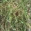 | 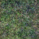 | 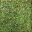 | 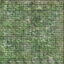


Looking at these images, one can see that all the generated images look somewhat "pixelated". The worst offender is the cGAN generated image, where it seems like there are digital artefacts left in the image.
What none of the three techniques manged to capture was the "strands" of grass texture that makes the actual image look so "real".

## Images generated across iterations

The code allows us to see images generated across iterations, but first, lets view some actual images of grass for reference. Below is a varied distribution of grass images from the training dataset.

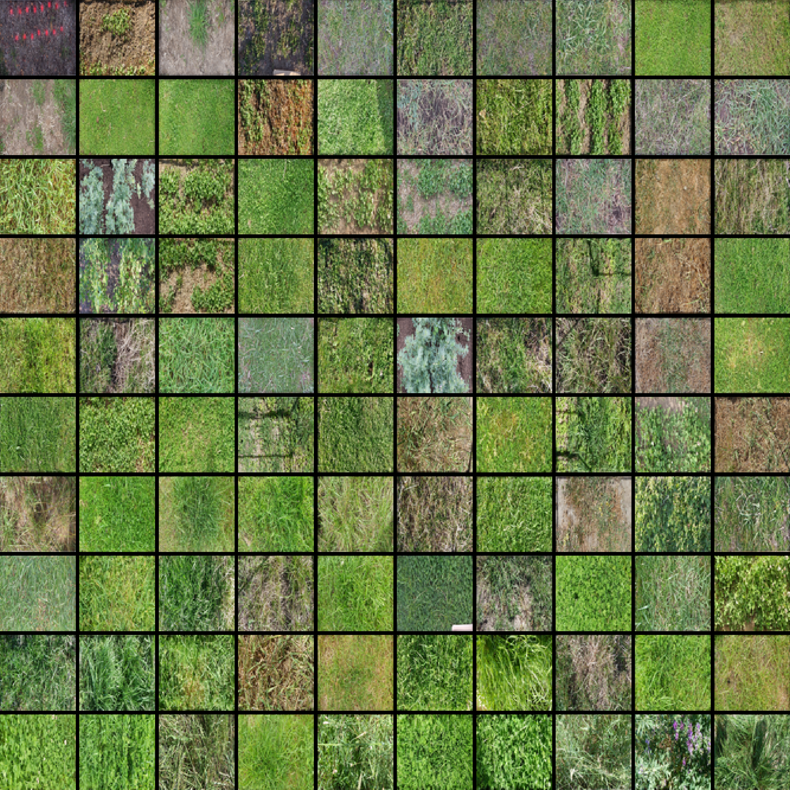

### *Best model (CcGAN Soft)*


| Iteration 100 | Iteration 1000 | Iteration 2000 |
| :---: | :---: | :---: |
| 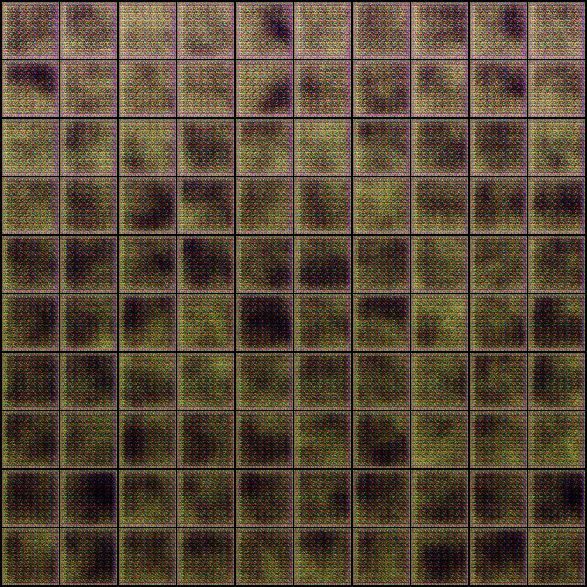 | 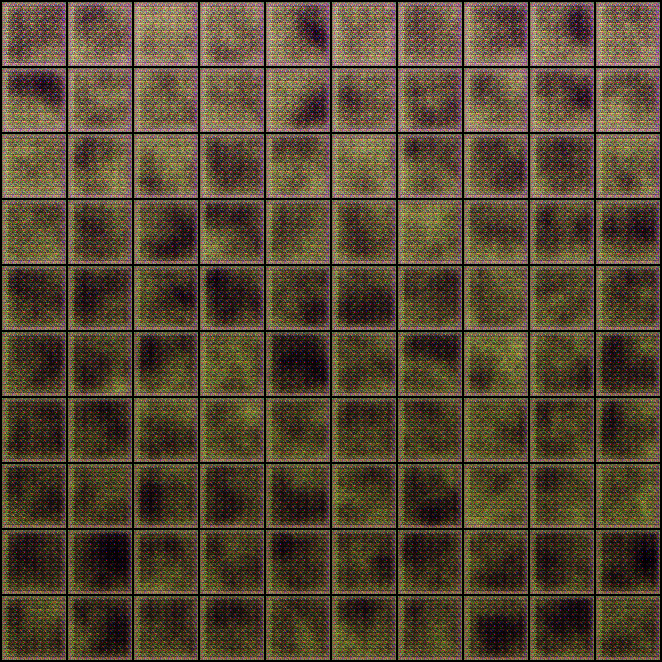 | 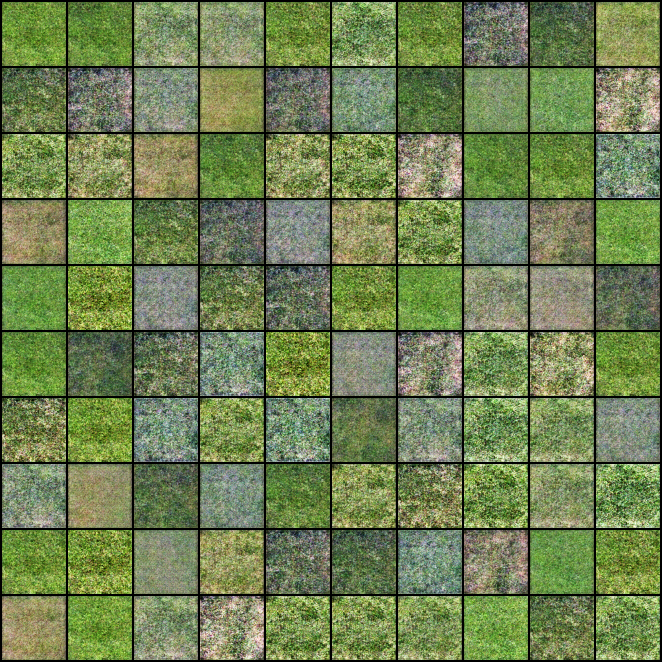 |

For instance at iteration 100, images created by the best model simply look like strange shadows.
After 1000 iterations, the images become somewhat clearer. Finally, after 2000 images, the images are even better.

From a distance, I may be fooled by some of images after 2000 iterations

### *Worst model (cGAN)*

| Iteration 100 | Iteration 1000 | Iteration 2000 |
| :---: | :---: | :---: |
| 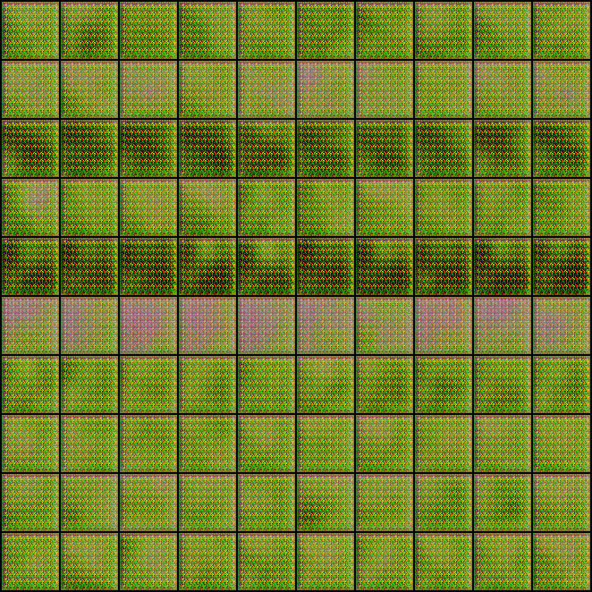 | 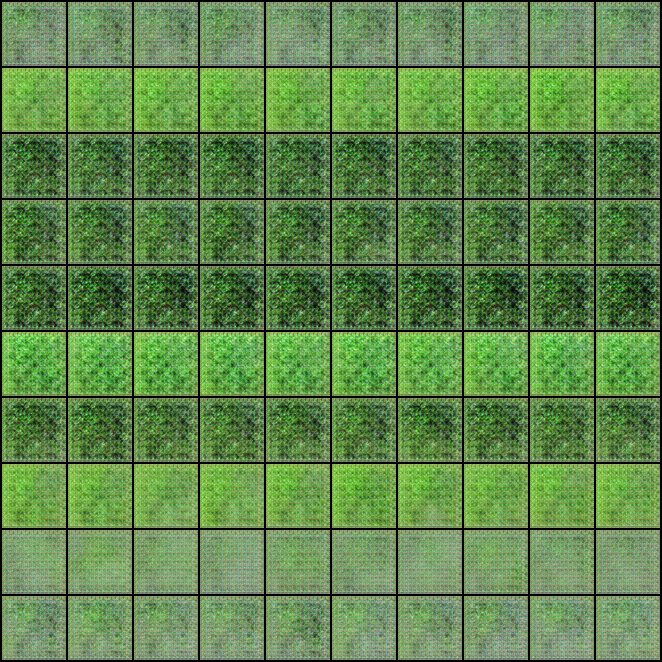 | 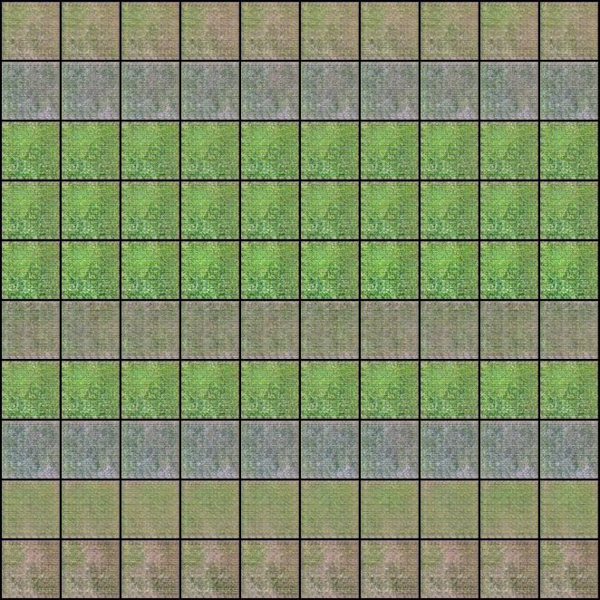 |


At iteration 100, the images look like strange grids.
After 1000 iterations, the images become somewhat better, the colour is there, but the grid is not gone, and there is very little variation between images. Finally, after 2000 images, the images are better, but much worse compared to those generated by the CcGAN.

I do not think any of these images could fool me to be grass.
