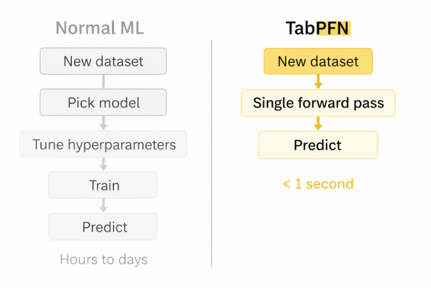
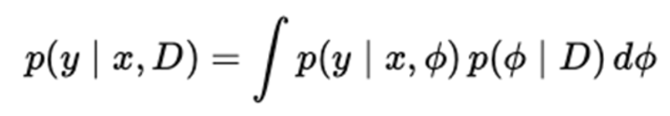
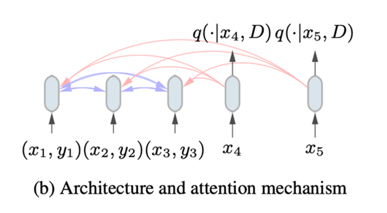

# Novel Method: TabPFN
Author: Kristofers Gulbis

## What it is

TabPFN (Tabular Prior Fitted Network) is a foundation model for tabular data. The original classification only version was published as Hollmann et al. (2023) https://openreview.net/pdf?id=cp5PvcI6w8_, for this implementation I used TabPFN v2 (Hollmann et al. 2025) https://www.nature.com/articles/s41586-024-08328-6, which adds regression support (this was allowed, for me to switch to v2 for the implementation even though, my in class presentation covered v1). Instead of training from scratch on our dataset, TabPFN is a transformer that has already been pretrained on millions of synthetic tabular datasets generated from a prior over structural causal models. At inference it takes the training set as in context examples (similar to how LLMs use context) and outputs predictions for the test rows in a forward pass.

## How it works

### The high level idea: swap the training loop for a forward pass

Normal ML models like ExtraTrees or a small neural nets all work the same way. You give them a dataset, they train on it, you get a fitted model back, and then you use it to predict. TabPFN works differently. The training has already happened once, offline, on millions of synthetic datasets that the authors generated. When you use it, you just hand it your real dataset and it gives back predictions in a single forward pass through the transformer, without ever actually fitting/training anything to your data.



The left side of the picture is the normal ML loop (dataset to training to model to predictions). The right side is TabPFN: the pretrained network is already sitting there, and at prediction time it takes the labelled training rows and the unlabelled test rows as input and just returns the predictions. No per task optimiser, no hyperparameter search, no weights that are specific to your dataset.

### Pretraining: a prior over structural causal models

All the compute for TabPFN happens in pretraining, and we never do that ourselves, we just download the weights. Hollmann et al. (2023) built a generator that samples **structural causal models (SCMs)**, basically small graphs of variables with noise and functions between them, and then turns each sampled graph into a fake dataset. The transformer is trained to look at the "training" rows of one of those fake datasets and predict the held out labels. Doing this on millions of these synthetic datasets teaches it how to approximately do Bayesian inference across a big range of data generating processes according to the authors. After pretraining, the weights roughly encode the idea: if your new dataset looks like one that could have come from this family of generators, here's the prediction that matches it.

### Inference: what the transformer is approximating

The correct thing to predict, given a training set `D_train = {(x_i, y_i)}` and a test input `x_test`, is the posterior predictive:



Which just means: look at every plausible model, weight it by how well it explains the training data, and average their predictions. That integral is almost never something you can actually compute, and normal ML gets around it by just training one model and using that. TabPFN's trick is that because it was pretrained on loss across that big family of synthetic datasets, the forward pass is basically doing that integral implicitly. When you feed it the training rows plus the test input, the output ends up being an approximation of the posterior predictive, so the "pick a model and tune its hyperparameters" step happens inside the network instead of before it.

### Architecture and the attention pattern



*Figure from Hollmann et al. (2023)*

TabPFN is a transformer with a slightly custom attention pattern. Each row of the dataset (training rows and test rows) becomes one token, and the training tokens carry their label while the test tokens don't. The attention is set up so that test rows can look at training rows (so they can find similar x values and copy over the label info), training rows can look at each other (so they build up a summary of the dataset), but test rows don't look at each other. So the prediction for one test row doesn't depend on what other test rows are in the batch, or their order. That's also why the same model can handle any number of test rows in one go.

### v2 and the `n_estimators` ensemble

v1 of TabPFN only did classification and only up to around 1,000 samples. v2 adds regression and scales up to around 10,000 samples and 500 features, thanks to a better architecture and a new positional scheme. It also runs the forward pass a few times with different feature orderings and preprocessings and averages the results, which is what the `n_estimators` argument on `TabPFNRegressor` controls. This smooths out how much the prediction depends on the order the features are given in.

### Practical properties that follow

- **No hyperparameter search needed.** The prior already covers what a good model should look like, so you don't need to run a grid or random search for every new dataset. That's nice on small datasets where CV based tuning is noisy on its own.
- **Works well on small and medium tabular datasets.** The pretraining prior was designed around that size range, which is pretty much where our task sits (around 357 rows, 128 features).
- **"Training" is basically free, the cost is at prediction time.** Every prediction is a transformer forward pass over the whole training set used as context, so prediction time scales with how many training rows you have. That's the tradeoff that made us turn on the `lower_resources` flag during CV (see Evaluation).

## Why does it fit this task

Our dataset is small (around 357 images after the long to wide pivot, 128 PCA reduced vision features). That's well within the range TabPFN was designed for (up to ~10k samples and ~500 features). Tree ensembles like ExtraTrees work fine but need some hyperparameter tuning to not overfit on small data; TabPFN's "no tuning" operating mode is a natural fit here.

## Implementation

Getting TabPFN running took more work than I thought it would. Here are the main things I ran into:

**Getting the model to download.** TabPFN doesn't ship the weights inside the pip package. The first time you call `.fit()` it tries to download them from Prior Labs, and the download is behind a license you have to get. So first I got `TabPFNLicenseError` until I registered on `ux.priorlabs.ai`, accepted everything, copied the API key from your account page, and set it as `TABPFN_TOKEN`. I dropped the token into `utils.py` and set it as an environment variable when the module is imported, so anyone cloning the repo can just run the scripts without doing the browser dance themselves. The token is inference only (no write access to Prior Labs resources) and low risk, so it's fine to keep in the repo, no need to hide it behind an env var.

**Making it work with multiple targets.** TabPFN only predicts one target at a time, but we have three (Dry_Green_g, Dry_Dead_g, Dry_Clover_g). The code already uses `MultiOutputRegressor` for exactly this situation, so I figured TabPFN would just fit right in. That didn't work, and figuring out why took a while. The first failure looked like a license error even though I'd set the token correctly, which was confusing. Reading the errors more carefully it turned out the error was actually raised inside a worker process, not in my main one. With `n_jobs=-1`, `MultiOutputRegressor` trains the three copies (one per target) in parallel worker processes. On macOS those workers start with the `spawn` method, which doesn't get the parent's `os.environ` changes, so `TABPFN_TOKEN` was fine in my main process but missing in the workers. On top of that, TabPFN objects don't fit cleanly into workers anyway. I tried a couple of things first (forcing the env var earlier in import order, constructing the model a bit differently) before settling on the simpler fix: detect the TabPFN case in `model_wrapper_creator` and force `n_jobs=1` for it so everything runs in one process. TabPFN does its own parallelism internally so the time increase from dropping external parallelism is pretty small and we are not running on GPUs.

**Reproducibility.** TabPFN runs several forward passes with shuffled feature orderings and averages them. If you don't set `random_state` it picks its own, which means two CV runs give slightly different numbers. Not a bug, just annoying when you're trying to compare models. I pass `TrainConfig.random_state` into the constructor so runs are repeatable.

**Switching between models.** I wanted it to be easy for the rest of the group to try different setups (different vision backbones etc.) without having to edit any code to change the regressor. So I added a `ModelType` enum and a `--model` flag on both `run.py` and `run_only_train.py`. Picking a model is just a CLI argument, no code edits.

**Making CV fast enough.** TabPFN's prediction time scales with the size of the training set, because every prediction is a transformer forward pass over all the training rows. Running a full 5 fold CV over the whole dataset was too slow to iterate on, so I used the `lower_resources` flag that was already in the code. It samples 160 image groups and runs CV on those. That's enough to compare models, and a full CV with TabPFN takes about 2 minutes on CPU instead of way longer.

## How the data reaches TabPFN

Once all of that is in place, I never call TabPFN's API directly. Everything goes through the sklearn `Pipeline` that `model_wrapper_creator` builds, so the same code path handles both ExtraTrees and TabPFN.

When `pipe.fit(X, y)` is called (either in `fit_full` for the full run, or inside each CV fold in `cv_mean_r2`):

1. The `ColumnTransformer` sends the raw vision features through a small `StandardScaler` + `PCA(n_components=128)` sub pipeline. The scaler and PCA are fit inside the sklearn Pipeline, so during CV they refit on each fold's train portion only and never see the validation rows. `test.csv` doesn't have the tabular columns (`State`, `Species`, `Pre_GSHH_NDVI`, `Height_Ave_cm`, date), so the pipeline only uses vision features, which means CV matches what production actually does.
2. `MultiOutputRegressor` clones the `TabPFNRegressor` once per target column (`Dry_Green_g`, `Dry_Dead_g`, `Dry_Clover_g`) and calls `.fit(X_processed, y_col)` on each clone. TabPFN's "fit" mostly just preprocesses and stores the training rows as context.
3. At `pipe.predict(X_test)`, each clone runs a forward pass over its training context plus the test rows and returns predictions for its target. `MultiOutputRegressor` stacks the three columns back together. The two composite targets (`GDM_g`, `Dry_Total_g`) are then computed from those three predictions.

The rest of the pipeline (loading data, vision features, CV, metrics) is shared with the ExtraTrees path, whose implementation was also done by me, so I was already familiar with all the code.

## Integration into the main pipeline/project

TabPFN is wired into both top level entry points, `src/main/run.py` (full pipeline that writes `submission.csv`) and `src/main/run_only_train.py` (5 fold CV evaluation), and is selected via a `--model {tabpfn, extra_trees}` CLI flag on each, with `tabpfn` as the default. The rest of the group can therefore compare regressors or swap vision backbones (`--vision-backbone {dino, resnet, convnext}`) without touching any code. Because the TabPFN and ExtraTrees paths share the exact same sklearn `Pipeline`, `ColumnTransformer`, in pipeline `StandardScaler` + `PCA(128)` stage, `MultiOutputRegressor` wrapping, `GroupKFold` CV loop, and metric code, the only thing that differs between any TabPFN row and the matching ExtraTrees row in the results table is the single output estimator inside `MultiOutputRegressor`. That's what keeps the comparison fair and makes the numbers below attributable to the regressor choice rather than to pipeline differences.

## Files I changed (individual work)

None of the changes are huge in line count, but a lot of them came out of debugging instead of just writing code.

**`pyproject.toml`**: added `tabpfn>=2.0.0` to `dependencies`. The v2 pin matters because v1 is classification only, v2 is the one with regression. `uv sync` pulls in tabpfn and its transitive stuff (torch, huggingface-hub, and a couple of Prior Labs telemetry/auth packages).

**`src/main/utils/utils.py`**: this is where most of the TabPFN related code ended up:

- Added a `ModelType` enum (`EXTRA_TREES`, `TABPFN`) with a `from_string` classmethod so the `--model` CLI string maps to a typed value and you get a clear error on typos.
- Added `model_type: ModelType = ModelType.EXTRA_TREES` to `TrainConfig` so the choice flows through the rest of the code via the config object.
- Rewrote `get_model()` to dispatch on `self.model_type`. When TabPFN is selected import `TabPFNRegressor` inside the function so `--model extra_trees` runs don't pay the tabpfn/torch import cost, and so the project doesn't break for anyone who hasn't run `uv sync` with the full dependency set yet. I also pass `random_state=self.random_state` in explicitly, otherwise TabPFN uses its own default and CV becomes non deterministic (see the reproducibility part above).
- Added the `TABPFN_TOKEN` constant and set `os.environ["TABPFN_TOKEN"] = ...` at module import time. Setting it inside `get_model()` would be too late, because sklearn can spawn workers before we ever call `get_model`, and those workers start with whatever environment exists at spawn time. Doing it at module import means the token is in the environment before any user code runs.

**`src/main/regression/baseline_training.py`**: `model_wrapper_creator` now picks `n_jobs=1` when `train_cfg.model_type == ModelType.TABPFN`, and otherwise uses `train_cfg.n_jobs` like before (so ExtraTrees behavior is unchanged). This is the one line fix for the worker process issue described above, but it was the thing that took me the longest to actually find.

**`src/main/run.py` and `src/main/run_only_train.py`**: both entry point scripts now take a `--model` argument via `argparse`, with choices `tabpfn` / `extra_trees` and default `tabpfn`. The string goes through `ModelType.from_string(args.model)` into `TrainConfig(model_type=...)`. Everything else in those scripts is unchanged. So picking a model is really just a CLI flag, no edits.

**On purpose left alone in the TabPFN work itself:** the `MultiOutputRegressor` wrapping, the CV loop (`cv_mean_r2`) and the metric code (`weighted_r2_global`). Those were already in the project before I implemented TabPFN, and I kept them untouched so the ExtraTrees vs TabPFN comparison would be the same. The preprocessor stack was later cleaned up as well, so `StandardScaler` and `PCA(128)` now refit per fold inside the sklearn `Pipeline` rather than once before CV. The results table below reflects the current fixed code. The only thing that actually differs between a TabPFN row and an ExtraTrees row is the single output estimator inside `MultiOutputRegressor`.

## Evaluation

Both models were evaluated with 5 fold `GroupKFold` cross validation, grouped by `image_path` so no image ends up in both the train and validation portion of a fold.

Setup:

- Vision backbone: pretrained ResNet18 (512-d features), DINOv2 (`dinov2_vits14`, 384-d), or ConvNeXt-Tiny (768-d)
- `StandardScaler` and then `PCA(n_components=128)` inside the sklearn `Pipeline`, so they refit on each fold's train portion (no leakage of validation fold statistics into the PCA basis or the scaler)
- No tabular features, because `test.csv` doesn't ship `State`/`Species`/`Pre_GSHH_NDVI`/`Height_Ave_cm`/date fields. The pipeline is vision only to keep CV honest against the production path.
- 5 folds `GroupKFold(groups=image_path)`, seed 42
- **CV subsampled to 160 image groups** via `TrainConfig.lower_resources=True` (the default). TabPFN's prediction time scales with training set size, so we subsample to keep iteration times under a couple of minutes on CPU. All six rows below use the same 160 group subset, so the model/backbone comparison is consistent; absolute numbers would likely improve somewhat on a full data run over the remaining ~200 groups.
- Metrics reported on out of fold predictions pooled across the 5 folds:
  - **Global weighted R²**: flattened per row weighting (`0.5` on Dry_Total_g, `0.2` on GDM_g, `0.1` on the rest)
  - **Per target weighted R²**: `Σ w_t · R²_t`, closer to the typical "weighted mean of per target scores" formulation
  - Per target R² for each of the five targets

TabPFN and ExtraTrees are fitted to the exact same preprocessed features, so swapping the vision backbone (ResNet / DINO / ConvNeXt) is the only variable that changes between any two rows within a regressor column.

### CV weighted R² (competition style metric, both flavors)

| Model                               | Global weighted R² | Per target weighted R² |
| ----------------------------------- | ------------------ | ---------------------- |
| ExtraTreesRegressor with DINO       | 0.507              | 0.336                  |
| ExtraTreesRegressor with ResNet     | 0.542              | 0.365                  |
| ExtraTreesRegressor with ConvNeXt   | 0.620              | 0.466                  |
| TabPFN with ResNet                  | 0.620              | 0.466                  |
| TabPFN with DINO                    | 0.645              | 0.513                  |
| **TabPFN with ConvNeXt**            | **0.662**          | **0.544**              |

### CV per target R²

| Target (weight)        | ET+ResNet | TabPFN+ResNet | ET+DINO | TabPFN+DINO | ET+ConvNeXt | TabPFN+ConvNeXt |
|------------------------|-----------|---------------|---------|-------------|-------------|-----------------|
| Dry_Clover_g (w=0.1)   | 0.244     | 0.359         | 0.373   | 0.435       | 0.342       | 0.598           |
| Dry_Dead_g   (w=0.1)   | 0.188     | 0.208         | 0.145   | 0.374       | 0.275       | 0.393           |
| Dry_Green_g  (w=0.1)   | 0.444     | 0.604         | 0.483   | 0.654       | 0.511       | 0.615           |
| GDM_g        (w=0.2)   | 0.438     | 0.543         | 0.403   | 0.575       | 0.522       | 0.574           |
| Dry_Total_g  (w=0.5)   | 0.380     | 0.481         | 0.310   | 0.503       | 0.497       | 0.537           |

**On CV, TabPFN beats ExtraTrees on every target and backbone combination.** There is no cell in the CV per target table where the baseline wins. The biggest jumps are on `Dry_Dead_g` with DINO (`0.145` to `0.374`) and on `Dry_Clover_g` with ConvNeXt (`0.342` to `0.598`). The hardest target overall is `Dry_Dead_g`, where even CV's best model (TabPFN with ConvNeXt at `0.393`) is well below the other four. That makes me think dead matter is just hard to pick up from the image itself, rather than the regressor being the problem.

For backbones under CV, ConvNeXt Tiny is the best for both regressors on the global weighted metric. DINO is second for TabPFN but third for ExtraTrees, and ResNet is third for TabPFN. Something interesting on CV: **TabPFN with ResNet features gets the same global weighted R2 as ExtraTrees with ConvNeXt features** (both `0.620`), and they tie on the per target weighted score too (`0.466` vs `0.466`). So moving from ExtraTrees to TabPFN basically compensates for using a weaker vision backbone.

### Kaggle leaderboard results

All six trained models were also submitted to the Kaggle competition. The scores below are the weighted R² that the Kaggle grader computed on the held out test set.

| Model                               | Private R² | Public R² |
| ----------------------------------- | ---------- | --------- |
| TabPFN with DINO                    | 0.118      | -0.174    |
| TabPFN with ResNet                  | 0.141      | 0.180     |
| ExtraTrees with ResNet              | 0.197      | 0.219     |
| TabPFN with ConvNeXt                | 0.232      | 0.193     |
| **ExtraTrees with ConvNeXt**        | **0.255**  | **0.242** |
| **ExtraTrees with DINO**            | **0.260**  | 0.173     |

### CV vs Kaggle: what we see

The Kaggle rankings look very different from the CV rankings, and that is worth being honest about in the writeup.

- **CV shows TabPFN wins, Kaggle says ExtraTrees wins.** The top two entries on the private leaderboard are both ExtraTrees (DINO at `0.260`, ConvNeXt at `0.255`). TabPFN's best Kaggle result is `0.232` (ConvNeXt), third from the top. On CV the ordering was essentially the opposite, with all three TabPFN rows beating their ExtraTrees counterparts.
- **Absolute numbers drop a lot.** Best CV global weighted R² was `0.662` (TabPFN + ConvNeXt). Best private leaderboard number is `0.260` (ExtraTrees + DINO). That's a big gap in absolute terms even for the winning row.
- **Public vs private is itself noisy.** The same model can move a lot between the two splits. TabPFN + DINO goes from `-0.174` public to `0.118` private. ExtraTrees + DINO goes from `0.173` public to `0.260` private. That variance suggests the test sets are small enough that a single submission is a noisy estimate of underlying model quality.

A few plausible reasons for the CV to Kaggle gap:

1. **CV used a 160 group subsample.** `lower_resources=True` was the default to keep TabPFN CV wall clock manageable. Subsampled CV is a less robust estimator of held out performance than full CV, and small subsamples tend to be more optimistic on small datasets like this one.
2. **Metric definition.** CV reports two weighted R² variants (flattened global, and per target weighted). Neither is guaranteed to be exactly the formula Kaggle uses, even though both use the same weight vector `{0.5, 0.2, 0.1, 0.1, 0.1}`. A small formula mismatch can shift absolute scores without necessarily flipping the ranking, but it makes a clean comparison harder.
3. **Distribution shift.** The Kaggle test set might come from a slightly different distribution than what GroupKFold on the training set is sampling. If the vision feature distribution is even a bit different, a flexible model like TabPFN that was pretrained on synthetic tabular priors could be relying on structure that doesn't generalise as well as a more "average all of these trees" model like ExtraTrees.
4. **ExtraTrees is more conservative by default.** On small noisy data, ExtraTrees tends to regress towards the mean more than a transformer based regressor. When the test set is small and noisy, that conservative bias can look like a better fit even if CV on the same held out distribution would say otherwise.


The honest conclusion is that TabPFN is clearly competitive in this setting, particularly in CV, but for this specific small data biomass task the tree ensemble generalises better to the Kaggle test split. ConvNeXt Tiny was the single strongest vision backbone across both regressors on the public leaderboard, which agrees with CV, so the vision backbone ranking is more stable than the regressor ranking.

### Reproducing

```bash
cd src

# CV evaluation (prints the three metrics for each model/backbone pair)
uv run python -m main.run_only_train --model extra_trees --vision-backbone resnet
uv run python -m main.run_only_train --model tabpfn      --vision-backbone resnet
uv run python -m main.run_only_train --model extra_trees --vision-backbone dino
uv run python -m main.run_only_train --model tabpfn      --vision-backbone dino
uv run python -m main.run_only_train --model extra_trees --vision-backbone convnext
uv run python -m main.run_only_train --model tabpfn      --vision-backbone convnext

# Submission runs (each produces a submission.csv for Kaggle)
uv run python -m main.run --model extra_trees --vision-backbone resnet
uv run python -m main.run --model tabpfn      --vision-backbone resnet
uv run python -m main.run --model extra_trees --vision-backbone dino
uv run python -m main.run --model tabpfn      --vision-backbone dino
uv run python -m main.run --model extra_trees --vision-backbone convnext
uv run python -m main.run --model tabpfn      --vision-backbone convnext
```

## Extra notes

I used the TabPFN Discord to find info on some issues I ran into while implementing it. I also used AI to help debug the code, fix some parts of it, proof read and structure this readme.


## References

- Hollmann, N., Müller, S., Eggensperger, K., and Hutter, F. (2023). TabPFN: A Transformer That Solves Small Tabular Classification Problems in a Second. International Conference on Learning Representations (ICLR). https://openreview.net/pdf?id=cp5PvcI6w8_
- Hollmann, N., Müller, S., Purucker, L., Krishnakumar, A., Körfer, M., Hoo, S. B., Schirrmeister, R. T., and Hutter, F. (2025). Accurate predictions on small data with a tabular foundation model. Nature.
https://www.nature.com/articles/s41586-024-08328-6,


